Gradeway creates **19 tables** on first start. Every table name is prefixed with the configured
`database.prefix` from `drivers.toml` (`gradeway_` by default), see
[Configuration](/gradeway/admin/configure#driverstoml). Since the schema is relational, third-party
plugins can query it directly instead of going through the API.

<Callout type="warn">
  Prefer the [API](/gradeway/dev/usage) for writes. Writing to the tables directly bypasses
  Gradeway's caches and messaging, so other servers won't pick up the change until their caches
  expire or are flushed with `/gradeway cache flush`.
</Callout>

## Schema

```mermaid
classDiagram
direction BT
class gradeway_group_permission_templates {
   uuid group_id
   uuid permission_template_id
}
class gradeway_group_permissions {
   uuid group_id
   uuid permission_id
   boolean is_enabled
}
class gradeway_groups {
   varchar(20) name
   integer default_weight
   timestamp created_at
   timestamp updated_at
   uuid id
}
class gradeway_permission_template_permissions {
   uuid template_id
   uuid permission_id
}
class gradeway_permission_templates {
   varchar(20) name
   integer assigned_to
   timestamp created_at
   timestamp updated_at
   uuid id
}
class gradeway_permissions {
   text value
   integer type
   uuid id
}
class gradeway_player_attributes {
   uuid player_id
   text type
   text key
   text value
   timestamp created_at
   timestamp updated_at
   uuid id
}
class gradeway_player_permission_templates {
   uuid player_id
   uuid permission_template_id
}
class gradeway_player_permissions {
   uuid player_id
   uuid permission_id
   boolean is_enabled
}
class gradeway_player_roles {
   uuid player_id
   uuid role_id
   timestamp until_at
   timestamp paused_at
   timestamp created_at
   timestamp updated_at
}
class gradeway_players {
   varchar(16) name
   integer weight
   uuid primary_role_id
   timestamp created_at
   timestamp updated_at
   uuid id
}
class gradeway_role_attributes {
   uuid role_id
   text type
   text key
   text value
   timestamp created_at
   timestamp updated_at
   uuid id
}
class gradeway_role_groups {
   uuid role_id
   uuid group_id
}
class gradeway_role_parents {
   uuid parent_id
   uuid child_id
}
class gradeway_role_permission_templates {
   uuid role_id
   uuid permission_template_id
}
class gradeway_role_permissions {
   uuid role_id
   uuid permission_id
   boolean is_enabled
}
class gradeway_roles {
   varchar(30) name
   integer weight
   timestamp created_at
   timestamp updated_at
   boolean is_default
   uuid id
}
class gradeway_track_stages {
   uuid track_id
   uuid role_id
   integer position
   uuid id
}
class gradeway_tracks {
   varchar(20) slug
   timestamp created_at
   timestamp updated_at
   uuid id
}

gradeway_group_permission_templates  -->  gradeway_groups : group_id.id
gradeway_group_permission_templates  -->  gradeway_permission_templates : permission_template_id.id
gradeway_group_permissions  -->  gradeway_groups : group_id.id
gradeway_group_permissions  -->  gradeway_permissions : permission_id.id
gradeway_permission_template_permissions  -->  gradeway_permission_templates : template_id.id
gradeway_permission_template_permissions  -->  gradeway_permissions : permission_id.id
gradeway_player_attributes  -->  gradeway_players : player_id.id
gradeway_player_permission_templates  -->  gradeway_permission_templates : permission_template_id.id
gradeway_player_permission_templates  -->  gradeway_players : player_id.id
gradeway_player_permissions  -->  gradeway_permissions : permission_id.id
gradeway_player_permissions  -->  gradeway_players : player_id.id
gradeway_player_roles  -->  gradeway_players : player_id.id
gradeway_player_roles  -->  gradeway_roles : role_id.id
gradeway_players  -->  gradeway_roles : primary_role_id.id
gradeway_role_attributes  -->  gradeway_roles : role_id.id
gradeway_role_groups  -->  gradeway_groups : group_id.id
gradeway_role_groups  -->  gradeway_roles : role_id.id
gradeway_role_parents  -->  gradeway_roles : child_id.id
gradeway_role_parents  -->  gradeway_roles : parent_id.id
gradeway_role_permission_templates  -->  gradeway_permission_templates : permission_template_id.id
gradeway_role_permission_templates  -->  gradeway_roles : role_id.id
gradeway_role_permissions  -->  gradeway_permissions : permission_id.id
gradeway_role_permissions  -->  gradeway_roles : role_id.id
gradeway_track_stages  -->  gradeway_roles : role_id.id
gradeway_track_stages  -->  gradeway_tracks : track_id.id
```

